# 🌌 Aethyr Aid — Verified Typhoon Relief Payments on Stellar

<p align="center">
  
</p>
<p align="center">
  <strong>Verified Typhoon Relief Payments on Stellar</strong>
</p>

<p align="center">
  <a href="https://github.com/pablo-pica/aethyr/actions"></a>
  
  
  
  
  
</p>

---

## 💡 Aethyr Aid — Current Level 4 Implementation

Aethyr Aid is a Stellar Testnet workflow for accountable typhoon-relief delivery. Donors fund token-backed campaign pools; admins manage campaigns, merchants, beneficiary case references, and vouchers; approved merchants redeem assigned vouchers with evidence attestations; and independent verifiers make the final payout or rejection decision. Beneficiaries have no wallet role. Raw evidence and personal data stay off-chain; the contract stores only opaque IDs and content digests.

The current implementation includes campaign funding and accounting, merchant approval, privacy-preserving case references, voucher issuance and redemption, append-only evidence during a freeze, admin emergency freezes, verifier-only approval/rejection, and atomic merchant payout. The hardened contract also prevents a verifier from approving that verifier's own merchant claim. Every live action is on Stellar Testnet; the app provides deterministic local clean and disputed walkthroughs before a user signs a transaction.

> **Status:** The Aid contract, Aid-first operational workspace, role-guided routes, Testnet workflow, production deployment, privacy-conscious telemetry, current desktop/mobile screenshots, 10+ user feedback gate, and final Green Belt demo are complete. The private deployed-site test collected 15 distinct wallet addresses, 12 reported live Testnet transactions, and 15 feedback responses; the complete response export and summary are documented in [`docs/GREEN-BELT-USER-TEST-RAW.csv`](./docs/GREEN-BELT-USER-TEST-RAW.csv) and [`docs/GREEN-BELT-FEEDBACK-SUMMARY.md`](./docs/GREEN-BELT-FEEDBACK-SUMMARY.md). The Level 4 package is ready for RiseIn submission; external reviewer evaluation follows submission. Mainnet, beneficiary wallets, identity/KYC, token conversion, and automatic payout are out of scope.

## At a glance

| Signal | Verified result |
|:--|:--|
| **Live product** | Production Aid workspace on Vercel with a hardened Soroban contract on Stellar Testnet. |
| **End-to-end behavior** | Clean payout and disputed release paths are implemented, tested, and demonstrated. |
| **User evidence** | 15 responses from 15 distinct wallets; 12 reported live Testnet transactions; 11 valid hashes preserved. |
| **Quality evidence** | 99 Vitest tests, 19 Rust tests, responsive/accessibility checks, visual baselines, PostHog, and Sentry evidence. |
| **Final demo** | [Published Level 4 video](https://youtu.be/yBHOUj8hG3k). |

## Why Aethyr Aid matters

Relief is not accountable merely because money moved. Donors and operators need a trustworthy path from funding to delivery, while beneficiary households should not have to manage crypto wallets or expose personal information on-chain.

| Real-world challenge | Aethyr Aid response |
|:--|:--|
| **Where did the aid go?** | Campaign accounting, purpose-bound vouchers, merchant redemption, evidence, and a public transaction trail. |
| **What if delivery is disputed?** | Admin freeze, one controlled evidence revision, independent verifier decision, and either atomic payout or reservation release. |
| **How do we protect people?** | Beneficiary case references and fixed-width digests keep personal records and raw evidence off-chain. |

### Start here

- **Public site:** [`/`](https://aethyr-pica.vercel.app/) explains the product; [`/app`](https://aethyr-pica.vercel.app/app) opens the operational workspace.
- **Roles:** Donor, Coordinator/Admin, Merchant/Cooperative, and Verifier have guided routes at `/app/aid/*`; authorization remains enforced by the connected wallet and contract.
- **Test safely:** Start in **Local demo**, then select **Live Testnet** and connect Freighter only when ready to sign. Never use Mainnet funds or enter real beneficiary data.
- **Validation guide:** [`docs/TESTNET-USER-WALKTHROUGH.md`](./docs/TESTNET-USER-WALKTHROUGH.md) documents setup, clean and disputed flows, negative checks, and privacy-safe evidence collection.
- **Implementation detail:** [`docs/LEVEL-4-IMPLEMENTATION-SPEC.md`](./docs/LEVEL-4-IMPLEMENTATION-SPEC.md) defines the state machines, authorization, accounting invariants, and privacy boundary.

---

## 🏆 Implemented Contracts and Application

### Smart Contract System (Soroban / Rust)
* 🔐 **Aethyr Aid Contract — current validation target** — Purpose-bound aid delivery with campaign custody, merchant registry, opaque beneficiary cases, vouchers, evidence attestations, emergency freeze, independent verifier resolution, and atomic payout.
  * **Hardened Testnet address**: [`CBZKE67HDBTWIZLKZFJOMEMJSENJOUHJVBURYED5M7VYUQCPJH5VOVIC`](https://stellar.expert/explorer/testnet/contract/CBZKE67HDBTWIZLKZFJOMEMJSENJOUHJVBURYED5M7VYUQCPJH5VOVIC)
  * **Important:** Do not use the historical Aid deployment listed in older submission material; it predates the verifier self-approval guard. Deployment and validation evidence are in [`docs/DEPLOYMENT.md`](./docs/DEPLOYMENT.md).
* 🔐 **Aethyr Router Contract** — Multi-hop DEX routing with atomic swaps and direct escrow funding.
  * **Address**: [`CA5ZEROS4VGIOZ2MIDVV7C7W4DFKWE76P4KBG455KO26RPKD2W3TC6MM`](https://stellar.expert/explorer/testnet/contract/CA5ZEROS4VGIOZ2MIDVV7C7W4DFKWE76P4KBG455KO26RPKD2W3TC6MM)
  * **Deployment Tx**: [`8ffea29ec2c445...`](https://stellar.expert/explorer/testnet/tx/8ffea29ec2c44577cfbc00a4c34b251a5e20a72c063a1ebf28dc0512cb78c01d)
* 🔐 **Aethyr Escrow Contract** — Milestone escrow contract invoked by Router.
  * **Address**: [`CD734V7PATOR7NW7APYQLUNEON2GZ7EUBM27MFQO3WDQZGCPKIWB6NOT`](https://stellar.expert/explorer/testnet/contract/CD734V7PATOR7NW7APYQLUNEON2GZ7EUBM27MFQO3WDQZGCPKIWB6NOT)
  * **Deployment Tx**: [`0362bad15f575c...`](https://stellar.expert/explorer/testnet/tx/0362bad15f575ce70d9ce291dd937ef39f2c7da2aaaaa07928bbf7ef8a8cd961)
* 🔐 **Aethyr Escrow Contract Features**:
  * **Milestone submission** by freelancers with on-chain timestamp tracking.
  * **Client dispute** flags that block auto-release.
  * **7-day auto-release** timer for uncontested submitted milestones.
  * **30-day refund lock** to protect against dispute-bypassing refund attacks.
  * **Dust-truncation protection**: Final milestone payouts use the remaining locked balance instead of basis-point division to prevent token dust loss.
  * **19 passing Rust contract tests** across the Aid, Escrow, and Router crates, covering clean and disputed delivery, authorization, accounting, and historical foundation behavior.

### Gasless Fee Sponsorship Relayer
* ⛽ **`/api/sponsor` Endpoint** — Server-side fee-bump transaction relayer that pays Soroban gas fees on behalf of users:
  * **Contract destination whitelisting**: Only `invokeHostFunction` calls targeting approved Aethyr contracts are sponsored (prevents fee-siphoning attacks).
  * **IP-based rate limiting**: 30 requests/minute per IP with `Retry-After` headers.
  * **Automatic client fallback**: If the relayer is unconfigured or fails, the frontend transparently falls back to user-paid fees.

### Frontend (Next.js 16 / TypeScript / Tailwind v4)
* 🧭 **Aid-first app routes**: `/app` opens the Aethyr Aid command center; `/app/aid/donor`, `/app/aid/coordinator`, `/app/aid/merchant`, and `/app/aid/verifier` open role-guided views with local-only role persistence.
* 🧰 **Protocol tools**: Send and Escrow remain available at `/app/tools/send` and `/app/tools/escrow` with the existing handlers.
* 🧪 **Safe preview**: `/preview` is deterministic, desktop-only, and contains no live wallet, sponsor API, contract, Send, Escrow, or Aid submission controls.
* 🦊 **Multi-Wallet Support**: StellarWalletsKit integration supporting Freighter, Albedo, and xBull via a unified modal selector.
* 🤖 **AI Intent Parser**: Gemini-powered natural language bar that converts human commands (e.g., *"Pay 100 XLM to GA... for Milestone 1"*) into structured transaction payloads.
* 📱 **Responsive Aid Design System**: One light editorial visual language across `/` and `/app`, with a desktop sidebar, mobile bottom navigation, visible focus states, reduced-motion support, and safe-area handling.
* 🏗️ **Visual Milestone Builder**: Drag-and-edit milestone card editor for composing AI-drafted escrow milestones before on-chain submission.
* 🧪 **99 passing Vitest tests** covering Aid lifecycle state, wallet submission, role-guided routes, privacy-aware observability, deterministic preview safety, and core UI behavior; `npm run test:ui` runs 9 responsive/accessibility checks, `npm run test:demo` verifies both Aid walkthroughs, and `npm run test:visual` runs 8 visual baselines against the production server.
* 🔒 **Pre-commit security hooks** scanning for Stellar private key leaks and running full test suites before every commit.

---

## 🎬 Live Demo & Presentation

* 🌐 **Live Application**: [Aethyr Aid on Vercel](https://aethyr-pica.vercel.app/)
* 🎬 **Final Green Belt demo**: [Watch on YouTube](https://youtu.be/yBHOUj8hG3k) — the published clean/disputed workflow demonstration.

---

## 🏗️ Current Aethyr Aid Architecture

The public site lives at `/`; the operational workspace lives at `/app`. The workflow may be explored with local deterministic data, then performed with distinct Testnet wallets. The Aid contract is separate from the historical Router and Escrow contracts, which do not participate in the Level 4 voucher lifecycle.

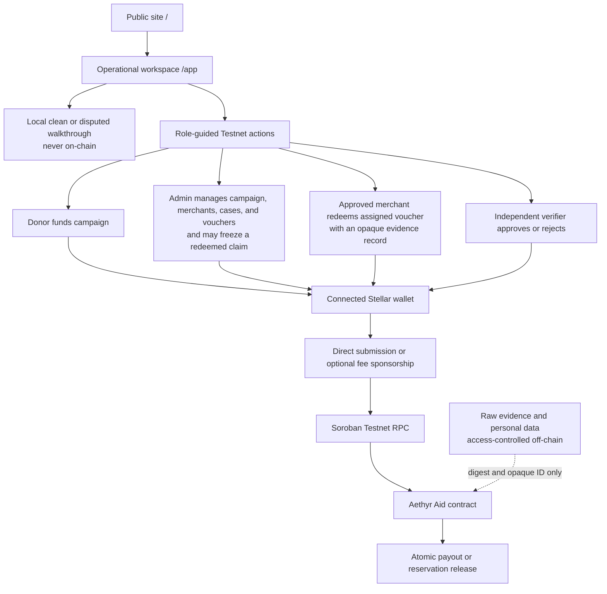

The contract enforces authorization, one-way state transitions, campaign reservations, payout conservation, and the verifier self-approval guard. Frontend role selection provides guidance only; it never grants authority.

---

## 📂 Code Navigation

Below is a map of the repository's directory layout to assist in codebase evaluation:

```text
aethyr/
├── .agents/                 # Developer agents instruction and status trackers
├── .github/workflows/       # CI/CD pipeline configuration
│   └── ci.yml               # GitHub Actions: lint, test (Rust + Vitest), build
├── contracts/               # Soroban smart contracts (Rust)
│   └── aethyr-router/
│       ├── contracts/
│       │   ├── aethyr-aid/      # Current Level 4 aid lifecycle contract
│       │   │   ├── src/lib.rs   # Campaign, voucher, evidence, freeze, and verifier actions
│       │   │   └── src/test.rs  # Clean, disputed, authorization, and accounting tests
│       │   ├── aethyr-escrow/   # Historical milestone-escrow foundation
│       │   │   ├── src/lib.rs
│       │   │   └── src/test.rs
│       │   └── aethyr-router/   # Historical routing foundation; not used by Aid vouchers
│       │       ├── src/lib.rs
│       │       └── src/test.rs
│       └── Cargo.toml           # Workspace manifest
├── docs/                    # Design documentation, architecture files, and submission assets
│   ├── assets/              # Interface screenshots and project banners
│   ├── IDEA-SUBMISSION.md   # Original approved product direction
│   ├── ARCHITECTURE.md      # Current Aid architecture and retained foundation notes
│   ├── LEVEL-4-IMPLEMENTATION-SPEC.md # Aid domain model, invariants, and acceptance evidence
│   ├── TESTNET-USER-WALKTHROUGH.md # Current live-Testnet validation runbook
│   ├── GREEN-BELT-USER-TEST-RAW.csv # Complete user-test export for submission evidence
│   ├── GREEN-BELT-FEEDBACK-SUMMARY.md # User-test ratings, raw comments, and summary
│   ├── DEPLOYMENT.md        # Hardened contract and deployment guidance
│   ├── BELT-REQUIREMENTS.md # JTM belt submission checklists through Level 6
│   ├── LEVELS-4-7-REQUIREMENTS.md # Program source requirements
├── scripts/
│   └── pre-commit.sh        # Git compliance hook (secret scanning + test runner)
├── src/
│   ├── app/                 # Next.js App Router pages and layouts
│   │   ├── api/sponsor/     # Gasless relayer API route
│   │   │   ├── route.ts     # Fee-bump builder with contract whitelisting + rate limiting
│   │   │   └── route.test.ts# Relayer unit tests
│   │   ├── page.tsx         # Public Aethyr Aid landing page
│   │   ├── app/             # Operational workspace, role routes, activity, settings, and tools
│   │   ├── preview/         # Deterministic non-operational preview
│   │   ├── page.test.tsx    # Landing-page integration tests
│   │   └── layout.tsx       # Global wrappers and metadata setup
│   ├── components/          # Reusable React components
│   │   ├── app-shell/       # Workspace routing, role persistence, and wallet controller
│   │   ├── workflows/aid/   # Aid overview, role chooser, and lifecycle action cards
│   │   ├── ui/              # BottomSheet, CustomNumberInput, SegmentedControl, ConfirmationDialog, Toast, InfoTooltip
│   │   ├── BottomNav.tsx    # Mobile-friendly PWA bottom tab navigation
│   │   ├── MilestoneBuilder.tsx # Visual milestone card editor
│   │   ├── ProfileDrawer.tsx# Wallet balance overview and account control bottom sheet
│   │   ├── WalletPickerBottomSheet.tsx # Custom dark wallet picker
│   │   ├── SendTab.tsx      # Main Send / Swap view component
│   │   ├── EscrowTab.tsx    # Escrow Creation form and milestones tracker view
│   │   ├── ActivityTab.tsx  # Interactive transaction log view
│   │   ├── SettingsTab.tsx  # Configurable network and slippage preset controls
│   │   └── WalletConnect.tsx# Interactive wallet status controller
│   ├── hooks/
│   │   ├── useFreighter.ts  # Legacy Freighter-only hook
│   │   └── useStellarWallet.ts # Full-featured hook: StellarWalletsKit, contract calls, gasless submit
│   ├── lib/
│   │   ├── aiParser.ts      # Gemini AI intent parser (natural language → tx params)
│   │   ├── aiParser.test.ts # Parser unit tests (6 cases)
│   │   ├── utils.ts         # Tailwind CSS styling and address helper functions
│   │   └── utils.test.ts    # Utility unit tests
│   └── styles/
│       └── globals.css      # Core Tailwind styling & safe-area notch utility configuration
├── package.json             # Package scripts and external dependencies
├── tsconfig.json            # TypeScript configuration
└── vitest.config.ts         # Vitest setup configuration file
```

### Key Implementation Files
* [Aethyr Aid contract](./contracts/aethyr-router/contracts/aethyr-aid/src/lib.rs): Campaign custody, merchant registry, privacy-safe cases, voucher lifecycle, evidence attestations, freezes, and verifier decisions.
* [Aid contract tests](./contracts/aethyr-router/contracts/aethyr-aid/src/test.rs): Clean and disputed delivery, authorization separation, replay protection, conservation, and TTL coverage.
* [Aid workspace](./src/components/workflows/aid/AidWorkspaceCards.tsx): Local walkthrough and Live Testnet lifecycle controls.
* [App workspace controller](./src/components/app-shell/AppWorkspaceController.tsx): Connected-wallet state and Aid action wiring.
* [useStellarWallet.ts](./src/hooks/useStellarWallet.ts): Wallet connection, Aid contract calls, direct submission, and optional sponsored submission.
* [route.ts (Sponsor)](./src/app/api/sponsor/route.ts): Optional fee sponsor with contract allowlisting and rate limiting.
* [lib.rs (Escrow)](./contracts/aethyr-router/contracts/aethyr-escrow/src/lib.rs) and [lib.rs (Router)](./contracts/aethyr-router/contracts/aethyr-router/src/lib.rs): Historical Level 3 foundation, retained for reference but not in the Aid voucher lifecycle.
* [pre-commit.sh](./scripts/pre-commit.sh): Git compliance hook — secret scanning and full test runner.

---

## 🔒 Security Model

| Threat | Mitigation |
|:-------|:-----------|
| **Fee-siphoning** via arbitrary contract calls | Relayer parses XDR operations and only sponsors `invokeHostFunction` calls targeting approved Aethyr contracts |
| **Rate-drain attacks** on sponsor wallet | IP-based rate limiter (30 req/min) with `429 Retry-After` responses |
| **Dispute-bypass refund** | Refund lock extended to 30 days (`LOCK_PERIOD_SECONDS`) so disputes cannot be front-run |
| **Dust token loss** on final milestone | Final milestone pays out full remaining balance instead of basis-point calculation |
| **Private key leaks** | Pre-commit hook scans diffs for Stellar seed patterns; `SPONSOR_SECRET_KEY` is never committed |
| **Unconfigured relayer in production** | Fail-fast `503` if `SPONSOR_SECRET_KEY` is absent; random fallback key only in `test` env |
| **Verifier self-approval** | The Aid contract rejects a verifier decision for a voucher redeemed by that verifier's merchant address |
| **Unauthorized operational action** | Contract authorization keeps donor, admin, merchant, and verifier permissions separate; the frontend role view is guidance only |
| **Personal data on-chain or in public telemetry** | Only opaque IDs and evidence/reason digests are used in Aid actions; raw evidence and personal data remain off-chain |

---

## 🏅 Belt Submission Evidence

Each belt section below maps **1:1** against the [Belt Requirements](./docs/BELT-REQUIREMENTS.md) checklist. Every requirement links directly to its proof — source file, Stellar Explorer transaction, or screenshot.

---

### ⚪ White Belt — Foundational PWA Container

<details>
<summary><strong>✅ All Requirements Met — Click to expand</strong></summary>

#### Core Tasks

| # | Requirement | Status | Evidence |
|:-:|:-----------|:------:|:---------|
| 1 | Connect a wallet via Freighter | ✅ | [`useFreighter.ts`](./src/hooks/useFreighter.ts) — `connect()` calls `requestAccess()` |
| 2 | Display connected wallet XLM balance | ✅ | [`useStellarWallet.ts`](./src/hooks/useStellarWallet.ts) — `fetchBalance()` queries Horizon |
| 3 | Wallet disconnect functionality | ✅ | [`useStellarWallet.ts`](./src/hooks/useStellarWallet.ts) — `disconnect()` resets state |
| 4 | Send a transaction on Stellar Testnet | ✅ | [`useStellarWallet.ts`](./src/hooks/useStellarWallet.ts) — `sendPayment()` builds and submits native XLM transfers |
| 5 | Display transaction feedback (success/failure) | ✅ | [`page.tsx`](./src/app/page.tsx) — toast notifications on tx result |
| 6 | Show transaction hash on completion | ✅ | [`page.tsx`](./src/app/page.tsx) — Activity ledger displays tx hash with explorer link |

#### Submission Assets

| Asset | Screenshot |
|:------|:----------:|
| **Wallet connected** — profile drawer displaying connected address and balances | 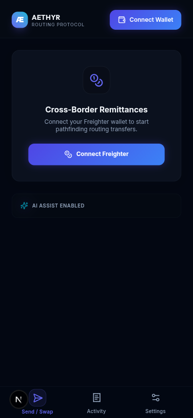 |
| **XLM balance** — main balance card fetching live Stellar Testnet balance | 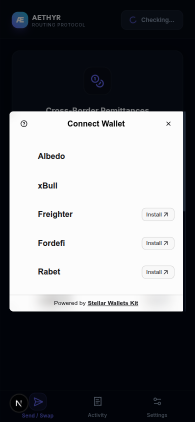 |
| **Transaction executing** — broadcasting status screen while signing in Freighter | 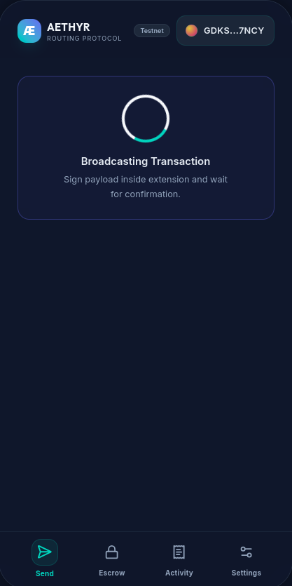 |
| **Transaction result** — success screen showing confirmed transaction hash and explorer link | 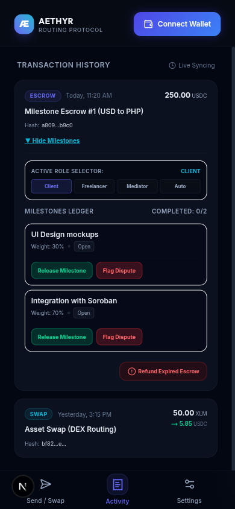 |

</details>

---

### 🟡 Yellow Belt — Soroban Smart Contracts

<details>
<summary><strong>✅ All Requirements Met — Click to expand</strong></summary>

#### Core Tasks

| # | Requirement | Status | Evidence |
|:-:|:-----------|:------:|:---------|
| 1 | Error handling for 3+ transaction error types | ✅ | [`useStellarWallet.ts`](./src/hooks/useStellarWallet.ts) — handles: **Wallet not found**, **User rejected**, **Insufficient balance** |
| 2 | Deploy a Soroban smart contract to Testnet | ✅ | Router contract: [`CA5ZERO...6MM`](https://stellar.expert/explorer/testnet/contract/CA5ZEROS4VGIOZ2MIDVV7C7W4DFKWE76P4KBG455KO26RPKD2W3TC6MM) |
| 3 | Call a contract function from the frontend | ✅ | [`useStellarWallet.ts`](./src/hooks/useStellarWallet.ts) — `routeToEscrow()`, `releaseMilestone()`, etc. invoke Soroban |
| 4 | Multi-wallet integration (StellarWalletsKit) | ✅ | [`useStellarWallet.ts`](./src/hooks/useStellarWallet.ts) — initializes `StellarWalletsKit` with `defaultModules()` (Freighter, Albedo, xBull) |
| 5 | Display contract tx status (pending/success/fail) | ✅ | [`page.tsx`](./src/app/page.tsx) — status badges + toast notifications for all contract operations |

#### On-Chain Proof

| Artifact | Value |
|:---------|:------|
| **Deployed Contract Address** | [`CA5ZEROS4VGIOZ2MIDVV7C7W4DFKWE76P4KBG455KO26RPKD2W3TC6MM`](https://stellar.expert/explorer/testnet/contract/CA5ZEROS4VGIOZ2MIDVV7C7W4DFKWE76P4KBG455KO26RPKD2W3TC6MM) |
| **Deployment Tx Hash** | [`8ffea29ec2c445...`](https://stellar.expert/explorer/testnet/tx/8ffea29ec2c44577cfbc00a4c34b251a5e20a72c063a1ebf28dc0512cb78c01d) |
| **Frontend Invocation Tx Hash** | [`cf417f87e58e3a...`](https://stellar.expert/explorer/testnet/tx/cf417f87e58e3a4cc53d4ee572115474afea0568609fbde6e49df2d8c5d14623) |
| **Commit Count** | 65+ conventional commits ([`git log`](https://github.com/pablo-pica/aethyr/commits/dev-branch)) |

#### Submission Assets

| Asset | Screenshot |
|:------|:----------:|
| **Multi-wallet modal** — Freighter, Albedo, xBull selection drawer | 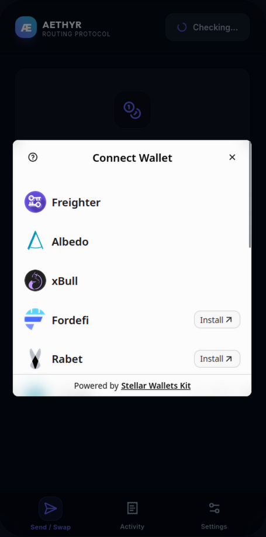 |
| **DEX pathfinding route** — real-time path routing visualization (XLM ➔ USDC ➔ PHP) and fee analysis | 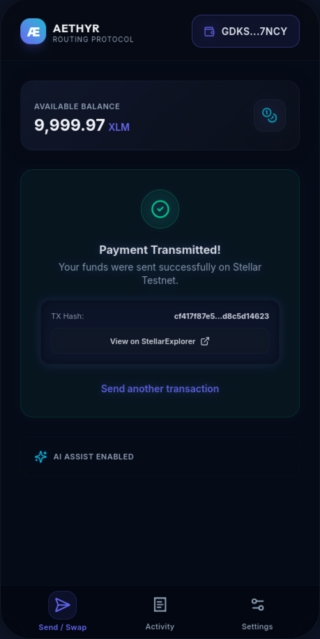 |

</details>

---

### 🟠 Orange Belt — Advanced Contracts, CI/CD & Production Architecture

<details>
<summary><strong>✅ All Requirements Met — Click to expand</strong></summary>

#### Core Tasks

| # | Requirement | Status | Evidence |
|:-:|:-----------|:------:|:---------|
| 1a | **Inter-contract communication** | ✅ | Router calls Escrow via `route_to_escrow()` → [`lib.rs (Router)`](./contracts/aethyr-router/contracts/aethyr-router/src/lib.rs) invokes [`lib.rs (Escrow)`](./contracts/aethyr-router/contracts/aethyr-escrow/src/lib.rs) |
| 1b | **Event streaming** from contracts | ✅ | Both contracts emit events via `env.events().publish(...)` — see [`lib.rs (Escrow) L179, L262, L306, L347, L388, L462`](./contracts/aethyr-router/contracts/aethyr-escrow/src/lib.rs) |
| 2 | **CI/CD pipeline** (lint + test + build) | ✅ | GitHub Actions: [`.github/workflows/ci.yml`](./.github/workflows/ci.yml) — runs `npm run lint`, `npm run test`, `npm run build`, and `cargo test` on every push/PR |
| 3 | **Mobile-responsive PWA** with safe-area notch | ✅ | [`globals.css`](./src/styles/globals.css) — `env(safe-area-inset-*)` + [`page.tsx`](./src/app/page.tsx) — max-width 420px phone shell |
| 4 | **Error handling & state indicators** | ✅ | Loading spinners, skeleton UI, toast notifications throughout [`page.tsx`](./src/app/page.tsx) and [`WalletConnect.tsx`](./src/components/WalletConnect.tsx) |
| 5a | **Smart contract tests** (Rust) | ✅ | **19 tests passing** across Aid (8), Escrow (7), and Router (4) crates |
| 5b | **Frontend tests** (Vitest) | ✅ | **99 tests passing** across 24 files |
| 6 | **Production-ready architecture** | ✅ | Gasless relayer with contract whitelisting, rate limiting, 30-day refund lock, dust-truncation fix — see [Security Model](#-security-model) |

#### Codebase Requirements

| Requirement | Status | Evidence |
|:-----------|:------:|:---------|
| Public GitHub repository | ✅ | [github.com/pablo-pica/aethyr](https://github.com/pablo-pica/aethyr) |
| 10+ meaningful commits | ✅ | **65+ conventional commits** — `feat:`, `fix:`, `test:`, `docs:`, `ci:` |
| Live demo on Vercel/Netlify | ✅ | [aethyr-pica.vercel.app](https://aethyr-pica.vercel.app/) |
| No hardcoded secrets | ✅ | All secrets via `.env.local` + [pre-commit hook](./scripts/pre-commit.sh) scanning for Stellar seeds |

#### On-Chain Proof

| Artifact | Value |
|:---------|:------|
| **Verified Escrow Contract** | [`CD734V7PATOR7NW7APYQLUNEON2GZ7EUBM27MFQO3WDQZGCPKIWB6NOT`](https://stellar.expert/explorer/testnet/contract/CD734V7PATOR7NW7APYQLUNEON2GZ7EUBM27MFQO3WDQZGCPKIWB6NOT) |
| **Inter-Contract Call Tx Hash** | [`cf417f87e58e3a4cc53d4ee572115474afea0568609fbde6e49df2d8c5d14623`](https://stellar.expert/explorer/testnet/tx/cf417f87e58e3a4cc53d4ee572115474afea0568609fbde6e49df2d8c5d14623) |

#### Submission Assets

| Asset | Screenshot |
|:------|:----------:|
| **Milestone Activity timeline** — tracking status of released/pending milestones with transaction hashes | 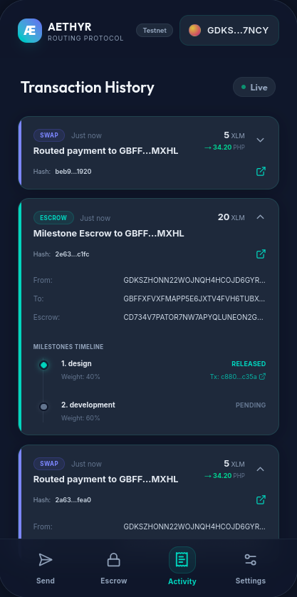 |
| **GitHub Actions CI/CD** — green/passing build and test runs dashboard | 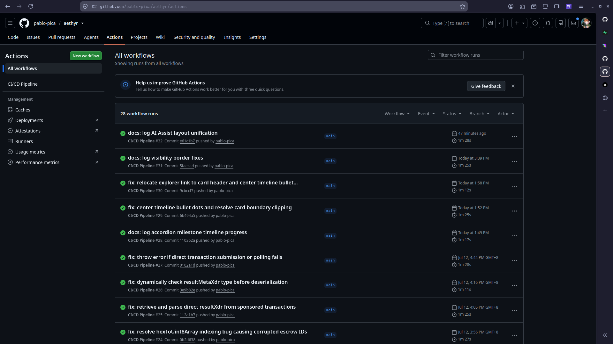 |
| **Test suite output** — 11 Rust contract tests and 59 Vitest frontend tests passing in terminal | 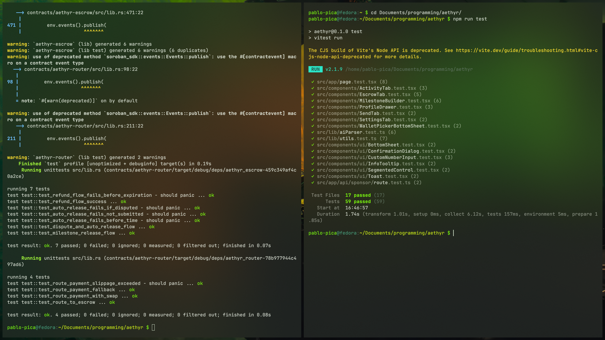 |
| **Video walkthrough** | [Final Aethyr Aid Green Belt demo (YouTube)](https://youtu.be/yBHOUj8hG3k) |

</details>

---

### 🟢 Green Belt — Level 4 submission evidence

<details open>
<summary><strong>✅ Final package — product, proof, and reviewer evidence</strong></summary>

**Aethyr Aid** is a privacy-conscious Stellar Testnet workflow for accountable relief delivery. This package demonstrates a complete path from campaign funding to voucher delivery, merchant evidence, independent verification, and either atomic payout or safe dispute resolution.

The final production demo is published on [YouTube](https://youtu.be/yBHOUj8hG3k). The repository contains the implementation specification, deployment record, Testnet validation runbook, user-test export, feedback analysis, and final product screenshots needed to evaluate the work without relying on local files or hidden context.

#### What the submission demonstrates

| Review focus | Evidence in this repository |
|:--|:--|
| **Technical complexity** | Multi-role campaign and voucher lifecycle, reservations, merchant redemption, evidence revision after freeze, independent verifier decisions, atomic payout, and safe reservation release. |
| **Product quality** | Role-guided onboarding, clear signing boundaries, responsive desktop/mobile layouts, visible loading/error/success states, and feedback-led improvements. |
| **Architecture quality** | Contract-enforced authority, separated admin/merchant/verifier responsibilities, privacy-preserving off-chain records, Testnet deployment, observability, and automated validation. |
| **Real-world usefulness** | A practical last-mile relief trail for donors, coordinators, merchants, verifiers, and beneficiary-serving organizations; 15 user responses from 15 distinct wallets, 12 reported live Testnet transactions, and 11 valid hashes are preserved in the evidence. |

#### Core Tasks

| # | Requirement | Status | Evidence |
|:-:|:--|:------:|:--|
| 1 | **Production-ready Aid MVP** — campaign funding, approved merchants, opaque beneficiary cases, vouchers, evidence attestations, freezes, verifier decisions, payout, and dispute release | ✅ | [Level 4 implementation spec](./docs/LEVEL-4-IMPLEMENTATION-SPEC.md) · [Aid contract](./contracts/aethyr-router/contracts/aethyr-aid/src/lib.rs) |
| 2 | **Clean delivery lifecycle** — fund campaign → issue voucher → redeem with evidence → verifier approval → atomic payout | ✅ | [Verified clean Testnet run](./docs/TESTNET-USER-WALKTHROUGH.md#4-test-the-clean-testnet-delivery-flow) · [published demo](https://youtu.be/yBHOUj8hG3k) |
| 3 | **Disputed delivery lifecycle** — freeze reservation → append one evidence revision → verifier rejection → release funds without merchant payout | ✅ | [Verified disputed Testnet run](./docs/TESTNET-USER-WALKTHROUGH.md#verified-disputed-testnet-run) · [negative checks](./docs/TESTNET-USER-WALKTHROUGH.md#6-required-negative-checks) |
| 4 | **Real-user validation** — at least 10 Testnet participants with wallet interaction proof | ✅ | 15 distinct wallets, 12 reported live Testnet transactions, and 11 valid hashes in the [complete export](./docs/GREEN-BELT-USER-TEST-RAW.csv) |
| 5 | **Feedback-led product validation** — collect and preserve user feedback | ✅ | 15 responses, ratings, raw comments, and improvement themes in the [feedback summary](./docs/GREEN-BELT-FEEDBACK-SUMMARY.md) |
| 6 | **Product quality** — responsive UI, role-guided onboarding, deterministic local walkthroughs, loading/error/success states, and accessible interactions | ✅ | [UI tests](./scripts/ui.spec.ts) · [Aid visual tests](./scripts/aid-visual.spec.ts) · [Aid workspace](./src/components/workflows/aid/AidWorkspaceCards.tsx) |
| 7 | **Observability** — privacy-constrained analytics and error monitoring | ✅ | [PostHog/Sentry instrumentation](./src/lib/observability.ts) · production evidence below |
| 8 | **Live release and documentation** — deploy the validated product and document how to verify it | ✅ | [Live application](https://aethyr-pica.vercel.app/) · [deployment record](./docs/DEPLOYMENT.md) · [validation runbook](./docs/TESTNET-USER-WALKTHROUGH.md) |

#### Codebase Requirements

| Requirement | Status | Evidence |
|:--|:------:|:--|
| Public GitHub repository with a complete README | ✅ | [github.com/pablo-pica/aethyr](https://github.com/pablo-pica/aethyr) · this README |
| Structured history with at least 15 meaningful commits | ✅ | 190+ conventional commits in the public repository |
| Live production deployment | ✅ | [aethyr-pica.vercel.app](https://aethyr-pica.vercel.app/) |
| No hardcoded secrets | ✅ | Environment-based configuration in [`.env.example`](./.env.example) · [pre-commit secret scan](./scripts/pre-commit.sh) |
| Automated quality gates | ✅ | [GitHub Actions](./.github/workflows/ci.yml) runs lint, frontend tests, build, and Rust tests |
| Standalone technical documentation | ✅ | [architecture](./docs/ARCHITECTURE.md) · [deployment](./docs/DEPLOYMENT.md) · [requirements](./docs/BELT-REQUIREMENTS.md) |

#### On-Chain Proof

All entries below are real Stellar Testnet evidence for the hardened Aid contract. The local clean and disputed walkthroughs are deterministic demonstrations only; the linked Explorer records are the on-chain proof.

| Flow | Action | Testnet proof |
|:--|:--|:--|
| Deployment | Hardened Aid contract | [`CBZKE67…VIC`](https://stellar.expert/explorer/testnet/contract/CBZKE67HDBTWIZLKZFJOMEMJSENJOUHJVBURYED5M7VYUQCPJH5VOVIC) |
| Deployment | Initialize admin | [`f7b025…`](https://stellar.expert/explorer/testnet/tx/f7b0254742b351b2997f8965b62348e2157d9a9d119ae13ac0de5e2c20471ac5) |
| Deployment | Provision separate verifier | [`80e98d…`](https://stellar.expert/explorer/testnet/tx/80e98d1ca202960a04643c2005574a7db23bc3cbbb7234b1f14e75b59686dee1) |
| Setup | Add AIDT trustline | [`e092b2…`](https://stellar.expert/explorer/testnet/tx/e092b26009f87da791b9ec5af887a6fe99486a94f847d2aac9e65db973852a87) |
| **Clean delivery** | Campaign creation | [`1878c8…`](https://stellar.expert/explorer/testnet/tx/1878c8b802969a8efe1f4dc2f14b60e5a37dfbf68ceea46ee521dd53b0c2dbb9) |
| Clean delivery | Campaign funding — 10 AIDT | [`185d22…`](https://stellar.expert/explorer/testnet/tx/185d2222ac478068d2573892bfeb1f90b5be1e71fc6b27ff34e7276924c943eb) |
| Clean delivery | Merchant approval | [`f8f3a0…`](https://stellar.expert/explorer/testnet/tx/f8f3a0348953b1e6bbdf32827996b848ed8d579f98c567f4ab35f52fe6045892) |
| Clean delivery | Beneficiary case creation | [`7f5a69…`](https://stellar.expert/explorer/testnet/tx/7f5a696e8d5ed0c8596a438f3e379b793ac06e58850b8f13012938fbbb497838) |
| Clean delivery | Voucher issuance — 2 AIDT | [`14a880…`](https://stellar.expert/explorer/testnet/tx/14a8800382ee7648b2edf6dc8c880cc96a8b44f31ee25bc9e61e51c264b8b11e) |
| Clean delivery | Merchant redemption with evidence | [`86bcdd…`](https://stellar.expert/explorer/testnet/tx/86bcdd8987428934be7f9800468c5b6d3c041f83694caa4763b226fb57d87a2b) |
| Clean delivery | Verifier approval and atomic payout | [`ecfeef…`](https://stellar.expert/explorer/testnet/tx/ecfeef0f7ee193dc5b707be33fceb0cbd99d4c5f09a7fa72d01b5ca07510454c) |
| **Disputed delivery** | Beneficiary case creation | [`ab415c…`](https://stellar.expert/explorer/testnet/tx/ab415c2654ad81ce899f273a183111c8f717e1aec26dd6f14ffeaa6c640c6b8d) |
| Disputed delivery | Voucher issuance — 1 AIDT | [`f7dcac…`](https://stellar.expert/explorer/testnet/tx/f7dcacf68e7efd0842033d5c029a56d44358089937302f53805d2fbe3ccb133c) |
| Disputed delivery | Merchant redemption with evidence | [`71dee0…`](https://stellar.expert/explorer/testnet/tx/71dee0c9f9f9ce9c787e896660158e93c82d9f41043b6d7fc85e922ba6e726f9) |
| Disputed delivery | Admin freeze | [`776752…`](https://stellar.expert/explorer/testnet/tx/7767526c4298886417d910fd76bed99fdaf1b3701d999a574dded67407ec4313) |
| Disputed delivery | Evidence revision | [`fa8663…`](https://stellar.expert/explorer/testnet/tx/fa8663d3d3208aa893ebe3772ba7fc378a09d8eb9fba8d26fbef3a69b4345306) |
| Disputed delivery | Verifier rejection and reservation release | [`602891…`](https://stellar.expert/explorer/testnet/tx/6028913de139357a9aaa73a75e4893c548cfee908df8fa98c056c7aede0fdb42) |

#### Submission Assets

| Asset | Screenshot |
|:--|:--:|
| **Production landing page — desktop** | 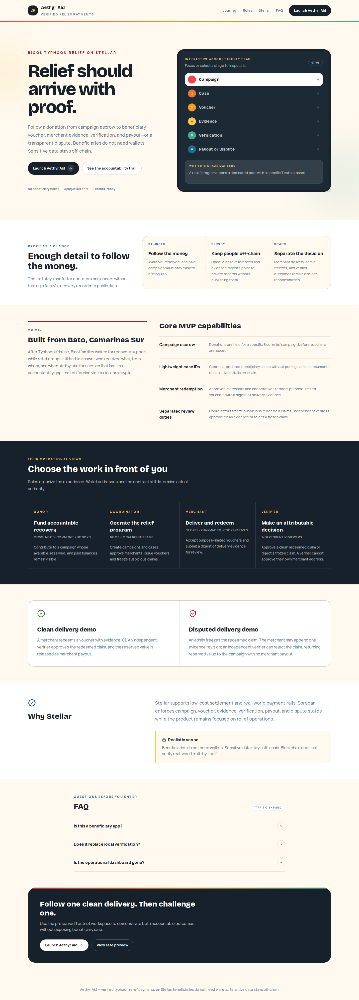 |
| **Production landing page — mobile** | 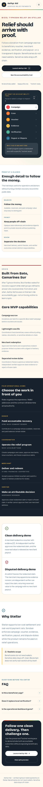 |
| **Aid operational workspace — desktop** | 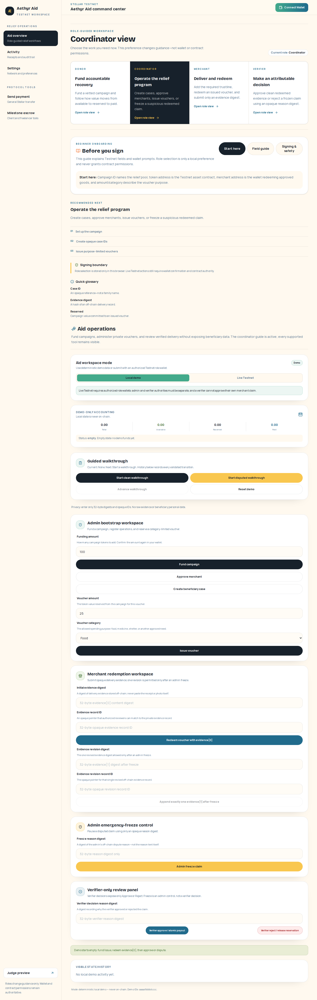 |
| **Aid operational workspace — mobile** | 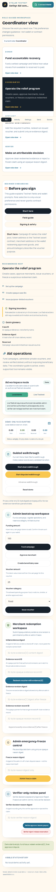 |
| **PostHog production event capture** | 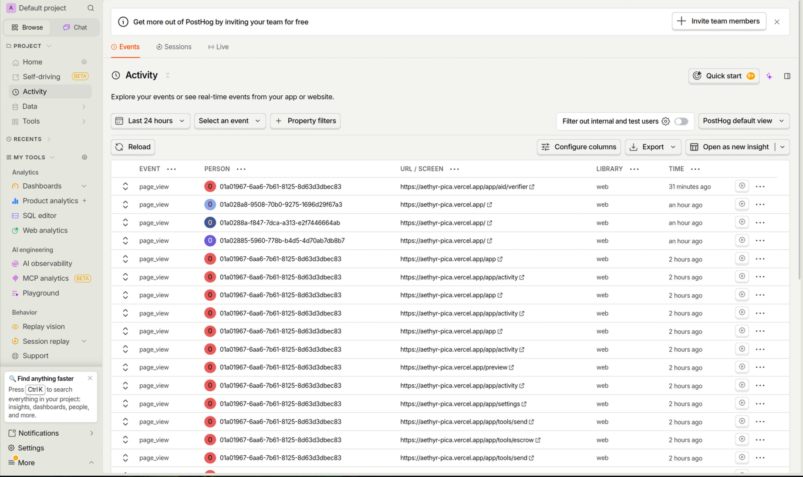 |
| **Sentry redacted error monitoring** | 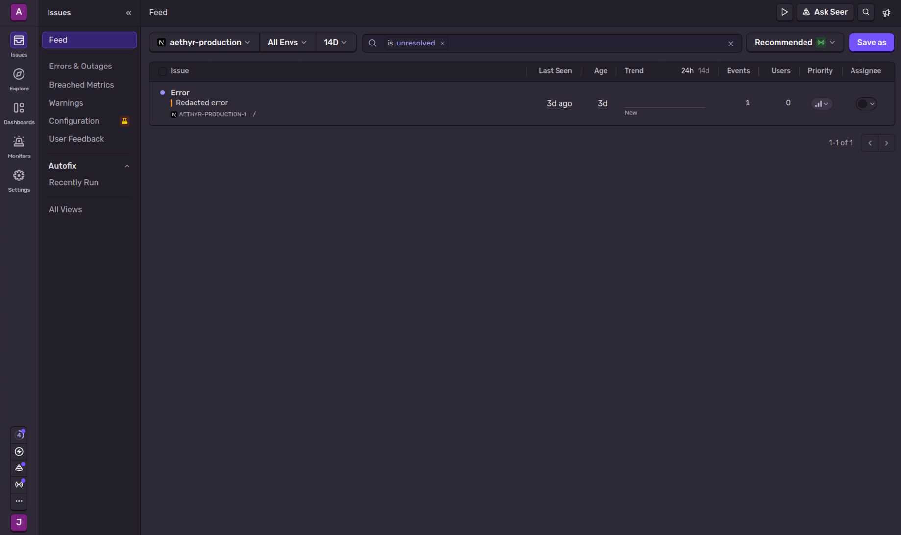 |

#### Submission Links

| Artifact | Link |
|:--|:--|
| **Final demo** | [Aethyr Aid — Level 4 video demonstration](https://youtu.be/yBHOUj8hG3k) |
| **Live application** | [aethyr-pica.vercel.app](https://aethyr-pica.vercel.app/) |
| **Hardened Aid contract** | [Stellar Expert — Testnet contract](https://stellar.expert/explorer/testnet/contract/CBZKE67HDBTWIZLKZFJOMEMJSENJOUHJVBURYED5M7VYUQCPJH5VOVIC) |
| **Testnet validation** | [`docs/TESTNET-USER-WALKTHROUGH.md`](./docs/TESTNET-USER-WALKTHROUGH.md) |
| **Deployment record** | [`docs/DEPLOYMENT.md`](./docs/DEPLOYMENT.md) |
| **User-test export** | [`docs/GREEN-BELT-USER-TEST-RAW.csv`](./docs/GREEN-BELT-USER-TEST-RAW.csv) |
| **Feedback analysis** | [`docs/GREEN-BELT-FEEDBACK-SUMMARY.md`](./docs/GREEN-BELT-FEEDBACK-SUMMARY.md) |
| **Level 4 requirements** | [`docs/BELT-REQUIREMENTS.md`](./docs/BELT-REQUIREMENTS.md) |

</details>

---

## 🛠️ Step-by-Step Quickstart

Follow these instructions to run Aethyr locally on your development machine.

### 1. Prerequisites
Ensure you have the following installed:
* **Node.js**: v22.22.2 or later
* **npm**: v10 or later
* **Rust / Cargo**: For compiling Soroban contracts
* **Stellar CLI** (Optional, for contract invokes): `cargo install --locked stellar-cli`

### 2. Project Installation
```bash
# Clone the repository
git clone https://github.com/pablo-pica/aethyr.git
cd aethyr

# Install project dependencies
npm install
```

### 3. Environment Configuration
Duplicate the example environment file:
```bash
cp .env.example .env.local
```

Open [env.local](./.env.local) and customize its parameters:
* `NEXT_PUBLIC_STELLAR_NETWORK`: Configures the target chain network. Set to `TESTNET` for public testing.
* `NEXT_PUBLIC_STELLAR_RPC_URL`: The RPC endpoint used for Horizon queries (e.g., `https://soroban-testnet.stellar.org:443`).
* `NEXT_PUBLIC_ROUTER_CONTRACT_ID`: The deployed Soroban router contract address (`CB...`).
* `NEXT_PUBLIC_ESCROW_CONTRACT_ID`: The deployed Soroban escrow contract address (`CC...`).
* `NEXT_PUBLIC_GEMINI_API_KEY`: The API key utilized to authenticate with the Gemini API for plain text intent parsing.
* `SPONSOR_SECRET_KEY`: *(Optional)* Secret key of the fee-sponsoring account. If unset, the gasless relayer is disabled and users pay their own fees.

### 4. Running the Development Server
```bash
npm run dev
```
Open [http://localhost:3000](http://localhost:3000) inside your web browser to test.

### 5. Running Verification Suites
Verify code health by running the verification commands:
```bash
# Run frontend unit and integration tests (Vitest)
npm test

# Run smart contract tests (Rust)
cd contracts/aethyr-router && cargo test

# Run code style and structure lints (Next.js ESLint)
npm run lint

# Start the production build in another terminal, then run browser checks
npm run start
npm run test:ui
npm run test:demo
npm run test:visual
```

---

## 🗺️ Product Roadmap

| Gate | Target | Outcome | Status |
|:-----|:-------|:--------|:------:|
| ⚪–🟠 Levels 1–3 | July 2026 | Wallet, contracts, PWA, tests, CI/CD, relayer, and demo foundation | ✅ Complete |
| 💡 Idea gate | July 2026 | Aethyr Aid direction approved | ✅ Complete |
| 🟢 Level 4 definition | Aug 3–6 | Domain model, implementation specification, acceptance criteria, and evidence package | ✅ Complete |
| 🟢 Level 4 contracts | Aug 7–14 | Tested campaign, voucher, registry, evidence, verification, and dispute logic on Testnet | ✅ Complete |
| 🟢 Level 4 product | Aug 15–20 | Complete donor/admin, merchant, and verifier workflows | ✅ Complete |
| 🟢 Level 4 validation | Aug 21–22 | Production deployment, monitoring/analytics, 10-user proof, feedback, and demo | ✅ Complete |
| 🟢 Level 4 submission | Aug 22 | Submit the Green Belt package to RiseIn tonight; external evaluation follows submission | 🎯 Ready tonight |
| 🔵 Level 5 | After Level 4 evaluation | 50 Testnet users, feedback-led improvements, verification thresholds, donor traceability, pricing checks, receipt, pitch, and demo | Future |
| ⚫ Level 6 | After Level 5 | Security review, local pilot, Mainnet, 20 verified users, public launch, and ecosystem contribution | Future |

See [`docs/BELT-REQUIREMENTS.md`](./docs/BELT-REQUIREMENTS.md) for the program requirements and submission checklist.

---

## 📄 License

No license file is currently included in this repository.
