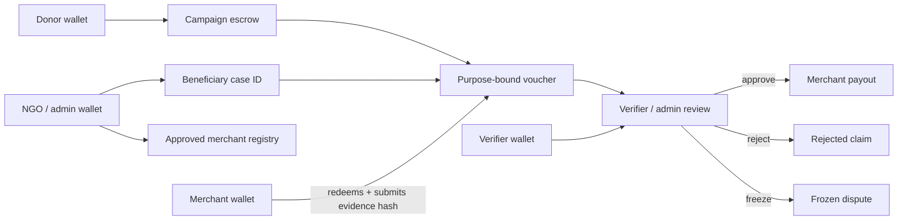

# 🏗️ Aethyr — System Architecture (ARCHITECTURE.md)

This document separates the **implemented Level 3 foundation** from the **planned Level 4 Aethyr Aid architecture** approved in [`IDEA-SUBMISSION.md`](./IDEA-SUBMISSION.md). Planned components are not implementation claims; their final interfaces must be defined and tested during Phase 5 in [`PROGRESS.md`](./PROGRESS.md).

---

## 🎯 Planned Level 4 Architecture: Aethyr Aid

### MVP Boundary

The Green Belt MVP traces one donation through campaign funding, voucher issuance, approved-merchant redemption, evidence submission, verifier/admin decision, and payout or dispute. It supports operational wallets for donors, NGO/admin users, merchants or cooperatives, and verifiers. Beneficiary households use case IDs and are not required to manage wallets.



### Planned Domain Records

The implementation specification must define the exact fields and state transitions for:

- Campaign escrow and available allocation.
- Approved merchant or cooperative registration and suspension.
- Beneficiary case ID with no personal data stored on-chain.
- Purpose-bound voucher and redemption status.
- Evidence hash and off-chain evidence reference policy.
- Verifier/admin attestation and decision.
- Payout, rejection, freeze, refund, and dispute outcomes.

### Privacy and Trust Boundary

- Personal beneficiary information, merchant identity documents, and raw delivery evidence remain off-chain.
- Only case identifiers, hashes, states, attestations, and payout records are candidates for on-chain storage.
- A hash proves that referenced evidence has not changed; it does not prove that the underlying evidence is true. Authorization and review policy remain required.
- Production and Mainnet promotion are separate gates. Level 4 targets Testnet contracts plus a production-hosted application; Mainnet is deferred until Level 6 security and pilot criteria are met.

### Reuse from the Level 3 Foundation

The Level 4 plan should evaluate reuse of the existing wallet integration, fee-sponsorship route, escrow authorization patterns, transaction status UI, tests, CI/CD pipeline, and Vercel deployment. Router/pathfinding and AI features are not automatically part of the voucher MVP.

---

## 🗺️ Implemented Level 3 System Overview

The current Aethyr application is a client-side dApp (PWA) that interacts with Stellar Testnet and Soroban RPC. Its existing Router and Escrow contracts provide the implementation foundation described below.

```
       +---------------------------------------------+
       |                  User View                  |
       |  [ PWA Frontend / Mobile-First viewport ]   |
       +---------------------------------------------+
                              |
          +-------------------+-------------------+
          |                                       |
          v                                       v
+-------------------+                   +-------------------+
|  AI Smart Assist  |                   |   Structured UI   |
| (Gemini Free API) |                   |  (PWA Input Form) |
+-------------------+                   +-------------------+
          |                                       |
          +-------------------+-------------------+
                              |
                              v (Intent parsed / Form filled)
       +---------------------------------------------+
       |             Route Calculator                |
       |  - Fetches orderbooks via Stellar SDK       |
       |  - Runs DFS/Dijkstra pathfinding locally    |
       |  - Returns: optimal path, fees, output amt  |
       +---------------------------------------------+
                              |
                              v (Select Path & Send)
       +---------------------------------------------+
       |           StellarWalletsKit                 |
       |  - Freighter, Albedo, xBull Module          |
       |  - Prompts signature on XDR                 |
       +---------------------------------------------+
                              |
                              v (Signed XDR)
       +---------------------------------------------+
       |             Stellar Network                 |
       |  - Soroban RPC submits tx                   |
       |  - Executes Aethyr Router smart contract    |
       |  - Performs Path Payment on-chain           |
       +---------------------------------------------+
```

---

## 🔀 Existing Routing Prototype

Stellar features a built-in decentralized exchange (DEX) with orderbooks and native/Soroban automated market makers (AMMs) or liquidity pools. Aethyr's key differentiator is resolving the most cost-effective path by dynamically scanning both orderbooks and AMM pools.

### 1. Hybrid Algorithm Design (Client-Side)
- **Path Resolution**: The frontend client queries the Horizon API `/paths` endpoint (which searches Classic orderbooks and Classic AMM pools) and interacts directly with Soroban RPC nodes to fetch reserves from Soroban-based AMM contracts.
- **Graph Representation**: Assets are represented as nodes. Edges are weighted dynamically based on transaction cost:
  - *Orderbooks*: Weighted by current bid/ask spreads, order depth, and calculated slippage curves.
  - *AMM Pools (Constant Product)*: Weighted by pool reserves ($X \times Y = K$) and pool swap fees (typically 0.3%).
- **Execution**: The dApp runs a localized hybrid pathfinding algorithm (modified Bellman-Ford or Dijkstra with depth limit 3 hops) to locate the path yielding the highest amount of `token_out` for a given `token_in`, taking into account trade price impact.

### 2. Traditional vs. Stellar Cost Comparison
Aethyr compares the computed path against traditional rails:
- **Wise / Western Union**: Fetches typical static fee percentages (e.g., 1.5% - 5%) via standard estimation algorithms.
- **Aethyr (Stellar)**: On-chain transaction fee (fixed at ~0.00001 XLM) + DEX slippage.
- **Result**: Visual comparison chart displayed in the UI showing savings.

---

## 📝 Smart Contract Layout

The implemented Level 3 foundation contains two Soroban smart contracts written in Rust:

### 1. `aethyr-router` (Payment Router)
Handles multi-token routing operations, converting asset A to asset B via intermediate pools or orderbooks. It validates the output against the client-side slippage tolerance and routes the payment.

#### Mock Swap Simulation Fallback
For testing or networks where standard liquidity pools do not exist, the router executes a mock swap simulation:
- **Conversion Rate**: A mock swap rate of `1.05` (representing 1 token_in = 1.05 token_out) is simulated if the contract holds sufficient balance of the target output token (`token_out`).
- **Direct Forwarding Fallback**: If the router contract holds insufficient balance of the output token, or if the input and output tokens are the same, it falls back to directly forwarding the input token (`token_in`) to the destination.

```rust
pub trait AethyrRouterTrait {
    /// Executes a routed payment from sender to recipient
    /// - `source`: Sender account (requires signature verification via require_auth)
    /// - `destination`: Recipient account or target escrow address
    /// - `path`: Vector of token contract addresses representing the route (e.g., [PHP, USDC, XLM])
    /// - `amount_in`: Exact amount of token_in to swap
    /// - `min_amount_out`: Slippage tolerance threshold
    fn route_payment(
        env: Env,
        source: Address,
        destination: Address,
        path: Vec<Address>,
        amount_in: i128,
        min_amount_out: i128,
    ) -> i128; // Returns actual amount transferred to destination

    /// Executes a routed payment from source, swaps the token, and locks it into an escrow contract
    /// - `source`: Sender account (requires signature verification via require_auth)
    /// - `escrow_contract`: Target escrow contract address
    /// - `receiver`: Recipient account receiving payouts upon milestone completion
    /// - `path`: Vector of token contract addresses representing the route
    /// - `amount_in`: Exact amount of token_in to swap
    /// - `min_amount_out`: Slippage tolerance threshold
    /// - `milestones`: Milestones configuration for the escrow
    fn route_to_escrow(
        env: Env,
        source: Address,
        escrow_contract: Address,
        receiver: Address,
        path: Vec<Address>,
        amount_in: i128,
        min_amount_out: i128,
        milestones: Vec<Milestone>,
    ) -> BytesN<32>;
}
```

### 2. `aethyr-escrow` (Milestone Escrow)
Locks funds and releases them to the recipient in installments as milestone criteria are completed. The releases are authorized by a designated third-party validator (oracle or notary) or by mutual agreement of the parties.

#### Initialization
The escrow contract requires initialization before use:
- **`initialize(env: Env, validator: Address)`**: Configures the designated validator/oracle address. If already initialized, it will panic with `"Already initialized"`.

```rust
// Standalone implementation functions
impl AethyrEscrow {
    /// Initializes the contract with a designated global validator/oracle address
    pub fn initialize(env: Env, validator: Address);
}

#[contracttype]
#[derive(Clone, Debug, Eq, PartialEq)]
pub struct Milestone {
    pub description: Symbol,   // Short description of the work
    pub payout_weight: u32,   // Payout percentage represented in basis points (e.g., 5000 = 50.00%)
    pub is_completed: bool,   // Completion status
    pub submitted_at: u64,    // Ledger timestamp of milestone submission
    pub is_disputed: bool,    // Milestone dispute status
}

pub trait AethyrEscrowTrait {
    /// Creates an escrow lock for a routed payment
    /// - `sender`: The account locking the funds (requires require_auth)
    /// - `receiver`: The account receiving payouts upon milestone completion
    /// - `token`: Soroban token address of locked funds
    /// - `amount`: Total amount locked
    /// - `milestones`: Vector of milestones with descriptions and payout weights
    fn create_escrow(
        env: Env,
        sender: Address,
        receiver: Address,
        token: Address,
        amount: i128,
        milestones: Vec<Milestone>,
    ) -> BytesN<32>; // Returns Escrow ID

    /// Releases funds for a specific milestone
    /// - `escrow_id`: Unique identifier of the escrow
    /// - `milestone_index`: The index of the milestone being completed
    /// - `auth_party`: The designated validator/oracle address authorizing release (requires require_auth)
    fn release_milestone(
        env: Env,
        escrow_id: BytesN<32>,
        milestone_index: u32,
        auth_party: Address,
    );

    /// Refunds remaining locked funds upon cancellation or failure
    /// - `escrow_id`: Unique identifier of the escrow
    /// - `sender`: The sender reclaiming funds (requires require_auth; only allowed after lock expiration)
    fn refund_escrow(
        env: Env, 
        escrow_id: BytesN<32>, 
        sender: Address
    );

    /// Submits a milestone by a freelancer (escrow receiver)
    fn submit_milestone(
        env: Env,
        escrow_id: BytesN<32>,
        milestone_index: u32,
        freelancer: Address,
    );

    /// Disputes a milestone by a client (escrow sender)
    fn dispute_milestone(
        env: Env,
        escrow_id: BytesN<32>,
        milestone_index: u32,
        client: Address,
    );

    /// Auto-releases a milestone after a 7-day period if not disputed
    fn auto_release_milestone(
        env: Env,
        escrow_id: BytesN<32>,
        milestone_index: u32,
    );
}
```

### 3. Soroban Security & Authorization Flow
Security is enforced using Soroban's native auth framework:
- **Sender Verification**: Both `route_payment` and `create_escrow` invoke `sender.require_auth()` to ensure the caller owns the funds being routed or locked.
- **Oracle / Validator Verification**: The `release_milestone` function invokes `auth_party.require_auth()` to prevent unauthorized release of funds.
- **Token Transfer Authorization**: The contracts utilize `token_client.transfer_from` requiring the user to have approved the contract address to transfer up to `amount_in` tokens.

---

## 🏦 Planned Cash-In / Cash-Out Integration

The current codebase does not claim a production anchor integration. A regulated cash-out path is deferred beyond Level 4. Candidate future standards must be selected against an actual partner's supported flow rather than documented as already implemented.

---

## 📱 Implemented Level 3 PWA Design & Navigation

To fulfill the mobile-first UX requirement, Aethyr is structured as an installable PWA resembling a native app. The interface uses a single-screen layout with an dynamic App Shell:

### 1. App Shell & Bottom Navigation
A sticky, touch-friendly **Bottom Navigation Bar** manages the primary routing views. It sits below a persistent header and handles view state transitions smoothly:
* **🔁 Send / Swap Tab (Active)**: The core multi-hop payment router, input forms, and AI Smart Assist bar.
* **📜 Activity Tab**: A list of current and historical transaction entries (pending, active, and completed on-chain escrow locks) with status badges and StellarExpert links.
* **⚙️ Settings Tab**: User-configurable preferences (slippage tolerance, network toggles, custom gas limits, and AI voice activation).

### 2. Header & Profile Drawer
The top app header is persistent across all views:
* **Left**: Aethyr branding.
* **Right**: The **Wallet Profile Button**. Tapping this slides open a glassmorphic **Profile Drawer** from the right, containing:
  - Connected wallet address (truncated with one-tap clipboard copy).
  - Consolidated multi-token balance list (XLM, USDC, Mock PHP, Mock NGN).
  - Quick-fund developer faucet link (Friendbot).
  - "Disconnect Wallet" action.

### 3. Service Worker & PWA Infrastructure
* **Caching**: Powered by `@serwist/next` for offline asset rendering.
* **Manifest (`public/manifest.json`)**: Configured for `standalone` display mode, a `#030712` theme color, and a `black-translucent` mobile status bar.
* **Safe Viewport Layout**:
  - Notch padding dynamically calculated via CSS variables:
    ```css
    padding-top: env(safe-area-inset-top);
    padding-bottom: env(safe-area-inset-bottom);
    ```
  - On desktop screens, the dApp is rendered inside a centered mobile mockup frame (`max-width: 420px`). On mobile devices, it scales to a true full-bleed native layout.

---

## 🔄 Implemented Level 3 Data Flows & State Changes

### Wallet Connection Flow
```
[User Connects] 
    --> [Freighter / WalletsKit Modal Opens]
    --> [User Selects Wallet]
    --> [Public Key Requested]
    --> [Key returned to React Context]
    --> [Horizon RPC queries account balance]
    --> [UI renders wallet address & balances]
```

### Transaction Routing & Execution Flow
```
[User inputs amount & recipient]
    --> [Route calculator runs locally]
    --> [Best path displayed to user for verification]
    --> [User clicks Send]
    --> [Frontend builds transaction XDR]
    --> [StellarWalletsKit prompts signing]
    --> [Signed XDR sent to Soroban RPC]
    --> [On-chain Router contract converts & transfers tokens]
    --> [Event listener captures success status]
    --> [UI renders confirmation & transaction Explorer link]
```
